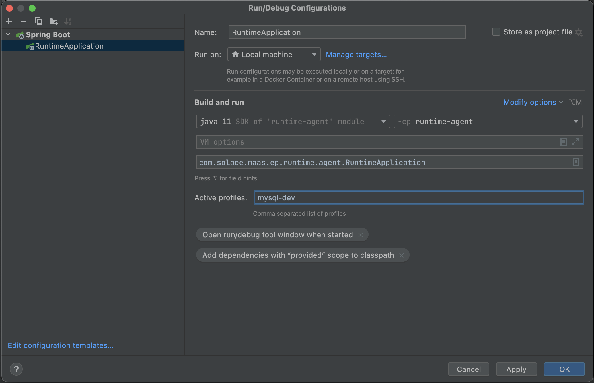

# Event Management Agent

The Event Management Agent is a tool used by architects and developers working with Event-Driven Architectures  (EDAs)
to discover event streams flowing through an event broker as well as the related broker configuration information. The
Event Management Agent can be used in two different ways:

* As a standalone tool that discovers runtime event data from event or message brokers in the runtime to retrieve EDA
  related data. This data can be exported as an AsyncAPI specification for the broker service to document the event flow
  information and be used with other tools supporting AsyncAPI specifications.
* As the Event Management Agent component of the Solace’s PubSub+ Event Portal product to:
    - discover runtime event data from event brokers
    - populate the Event Portal Designer and Catalog services with EDA data from the runtime enabling the management and
      reuse of EDA assets
    - audit the runtime data and flag discrepancies between the runtime and the design time intent for event data
      governance purposes, and ensure that the runtime and design time configurations stay in-sync

Our plan is to open source the Event Management Agent to enable architects and developers to contribute to it as well as
to build new plugins so that:

* runtime data can be discovered from additional broker types
* existing plugins can be extended to discover additional data
* EDA data can be discovered from other systems, e.g. schemas from schema registries

At this stage (September 2022), the Event Management Agent is still in an active development phase.

### Available today:

* Users can discover Solace PubSub+ and Apache Kafka brokers event flow data
    - Users can discover Solace PubSub+ queues and subscriptions
    - Users can discover Apache Kafka topics and consumer groups
    - Users can discover Confluent Schema Registry schemas
* Users get discovered data in the form of JSON files separated by entity types
* The Event Management Agent architecture is currently in the form of Java packages

On the roadmap:

* Support for Confluent and MSK flavours of Apache Kafka
* The Event Management Agent has an open source plugin framework
* Support additional Solace PubSub+ and Apache Kafka event broker authentication types in the form of plugins such as
  basic authentication, certificates, Kerberos, etc.
* Collection of topics from events flowing though Solace PubSub+ brokers
* Import discovered data into the Solace PubSub+ Event Portal
* Export discovered data as AsyncAPI specifications
* Addition of the infrastructure needed for the Event Management Agent to be a true open source project
* Discovery of Apache Kafka connectors
* Discovery of schemas from schema registries
* Introduction of a UI for the Event Management Agent
* Additional support to more broker types
* Event Management Agent Docker images
* Event Management Agent executables

## Running the Event Management Agent

### Prerequisites:

* Java 11 (AdoptOpenJDK 11.0.14+ https://adoptium.net/temurin/releases)
* Maven
* Docker (for running the Event Management Agent with MySQL database)
* Event Management Agent Region (for cloud mode)

### Minimum hardware requirements

The Event Management Agent was tested to run with

* 1 CPU
* 1 GB RAM

### Spring-boot properties

These properties are required to run this spring boot application in cloud mode. Update the following properties in the
application.yml file

```
eventPortal.gateway.messaging.connections.url = <secure smf host and port> example  tcps://<host>:<port>
eventPortal.gateway.messaging.connections.msgVpn = <your vpn>
eventPortal.gateway.messaging.connections.users.name= <your name>
eventPortal.gateway.messaging.connections.users.username = <your username>
eventPortal.gateway.messaging.connections.users.password = <your password>
eventPortal.gateway.messaging.connections.users.clientName= <your client name>
```

### Cloning and Building

#### Steps to build and run the service

1. Clone the event-management-agent repository

```
git clone https://github.com/SolaceLabs/event-management-agent.git
```

2. Install maven dependencies

```
cd event-management-agent/service
mvn clean install
```

3. Start the Event Management Agent

```
java -jar application/target/event-management-agent-0.0.1-SNAPSHOT.jar
```

Alternatively, to build and run the service in IDE

1. Clone the event-management-agent repository

```
git clone https://github.com/SolaceLabs/event-management-agent.git
```

2. The Event Management Agent uses H2 database by default. The H2 console is available at `http://localhost:8180/h2`.
   The database is available at `jdbc:h2:file:./data/cache`.

3. The connection details for the H2 database are specified using the following properties in the application.yml file

```
spring.datasource.url
spring.datasource.username
spring.datasource.password
spring.datasource.driver-class-name
spring.h2.console.path
```

4. Alternatively, to use MySql database

    1. save the code below to a yml file, then run `docker-compose up` against the file. **
       Note**: For Macbook users with M1 chip, add the property `platform: linux/x86_64` to the file

   ```
   version: '3.1'

   services:
    db:
      image: mysql
      container_name: mysql8
      command: --default-authentication-plugin=mysql_native_password
      restart: always
      ports:
        - "3308:3306"
      environment:
        MYSQL_ROOT_PASSWORD: secret
      volumes:
        - ./my-datavolume:/var/lib/mysql 
     ```

    2. Create the `event-management-agent` database

    ```
    create database if not exists event-management-agent;
    ```

    3. Create an active profile named `mysql-dev` in Spring Boot Run Configurations

   

    4. Create new yml file in resources with the name `application-mysql-dev.yml`&nbsp;

    5. Add the code below to the file

    ```
    spring:
      datasource:
        url: jdbc:mysql://localhost:3308/event-management-agent
        username: root
        password: secret
        driver-class-name: com.mysql.jdbc.Driver
      jpa:
        database-platform: org.hibernate.dialect.MySQL8Dialect
        hibernate:
          ddl-auto: create
    ```

5. Start the application by running this class in Intellij

```
service/application/src/main/java/com/solace/maas/ep/event/management/agent/EMAApplication.java
```

## Broker Plugins

The Event Management Agent comes with the following event or message broker plugins included:

* Apache Kafka
* Solace PubSub+
* Confluent Schema Registry
* MSK

The default application.yml provides various plugin examples. For Kafka, the properties section under credentials is
passthrough. For example a property in ConsumerConfig or SSLConfigs classes.

If using AWS IAM, the AWS Access Key Id and AWS Secret Access Key need to be present. Two ways is either via environment
or credentials file as shown below:

Put a file with the following contents into a ~/.aws/credentials file

```
[default]
aws_access_key_id = <aws_access_key>
aws_secret_access_key = <aws_secret_key>
```

Can alternatively make these environment variables (these will also override the credentials file if present)

```
export AWS_ACCESS_KEY_ID=<aws_access_key>
export AWS_SECRET_ACCESS_KEY=<aws_secret_key>
```

## Deployment

There are essentially 2 main modes of deployment:

* Solace PubSub+ Console Connected: The Event Management Agent connects to the event management region and can be
  controlled remotely via Event Portal

* Stand-alone: The Event Management Agent is controlled via the REST API and results must be uploaded manually.

## Running a scan

### REST interface

The Event Management Agent includes a REST API that allows the user to initiate a scan. Each plugin requires its own
custom set of authentication and identification attributes that must be supplied by the user.

See [REST Documentation](docs/rest.md) for additional information

## Importing Scanned Data

To import scanned data into Event Portal:

* Set up a new standalone Event Management Agent.
* Run a scan according to the instructions here: [Running Scans](docs/rest.md#running-scans)
* After the scan is complete, create a .zip file containing the scan files by sending a GET request to the
  endpoint `http://localhost:8180/api/v2/ema/messagingServices/export/{scanId}/zip`
* Locate the .zip file in the directory `data_collection\zip`. The .zip file is named as `{scanId}.zip`
* Set up a second Event Management Agent that is connected to Event Portal.
* Use a method approved by your organization's security policies to copy the .zip file to the second Event Management
  Agent.
* Start the data import process by sending a POST request to the
  endpoint `http://localhost:8180/api/v2/ema/messagingServices/import`. Add the .zip file to the body of the request
  using `file` as the key.
* After sending the POST request, the Event Management Agent will start the import process.

## Motivations

See [motivations](./docs/motivations.md)

## Testing

There are several interesting scenarios to test the Event Management Agent. These scenarios can be divided into two main
categories according to the deployment mode.

* Testing the Event Management Agent as standalone service (stand-alone deployment).
* Testing the end-to-end flow in Solace PubSub+ Console connected mode (From the frontend to the Event Portal, then to
  the Event Management Agent)

### Testing the Event Management Agent in standalone mode

The most important test in standalone mode is to ensure that the Event Management Agent runs and collects data properly.
To that end, the test includes the steps below:

1. Update the `plugins` section of the `application.yml` with the details of the messaging service you want to scan.
2. Start the Event Management Agent either from the IDE or by running the JAR file.
3. Examine the on-console logs for a log from `MessagingServiceConfig` class indicating that the messaging service(s)
   has been created. **Note**: The logs may differ according to the messaging service(s) specified in the
   `application.yml` file.

```
c.s.m.e.r.a.c.MessagingServiceConfig : Created Messaging Service: kafkaDefaultService confluent kafka cluster KAFKA
c.s.m.e.r.a.c.MessagingServiceConfig : Created Messaging Service: solaceDefaultService staging service SOLACE
```

4. View the Swagger documentation to learn about the available REST endpoints for the Event Management Agent. To access
   the Swagger documentation, use the link `http://localhost:8180/event-management-agent/swagger-ui/index.html` (Note:
   The Event Management Agent is under continuous development. Therefore, please check the Swagger documentation to make
   sure that you are using the recent endpoint schema).
5. Initiate a scan against a messaging service by sending a POST request to the endpoint that triggers the data
   collection `/api/v2/ema/messagingServices/{messagingServiceId}/scan`. The request can be sent using either Postman or
   a curl command.
6. Ensure that the `destinations` in the request body contains `FILE_WRITER`, i.e., `"destinations":["FILE_WRITER"]`,
   then send the request.
7. Confirm that you receive a scan id, e.g., `3a41a0f5-cd85-455c-a863-9636f69dc7b2`
8. Examine the Event Management Agent console logs to make sure that individual scan types are complete. e.g.,
   `Route subscriptionConfiguration completed for scanId 3a41a0f5-cd85-455c-a863-9636f69dc7b2`
9. Examine the collected data by browsing to the directory `data_collection`. This directory is organized as
   {schedule_id}/{scan_id}/{scan_type.json}
10. Verify that the collected data contains a separate JSON file for each scan type.
11. Verify the contents of each JSON file.
12. Check the logs by browsing to `data_collection/logs/{scan_id}.log` and `general-logs.log` to make sure no exceptions
    or errors occurred.
13. Finally, if you have added the `EVENT_PORTAL` as a destination, check the Event Portal tables to confirm they
    contain the scanned data.

## Contributions

Contributions are encouraged! If you have ideas to improve an existing plugin, create a new plugin, or improve/extend
the agent framework then please contribute!

## Contributors

@gregmeldrum @slunelsolace @AHabes @MichaelDavisSolace @helrac @moodiRealist
